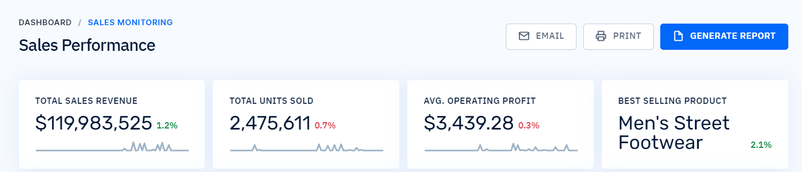
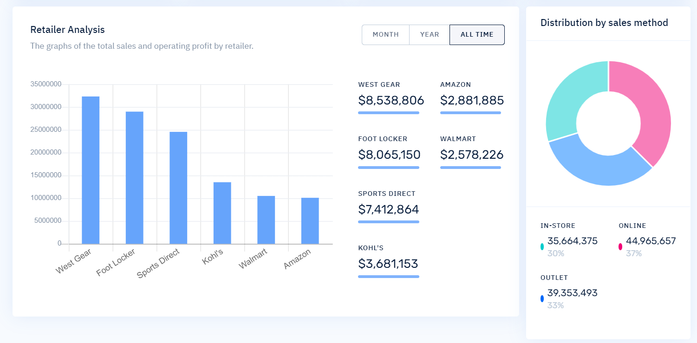
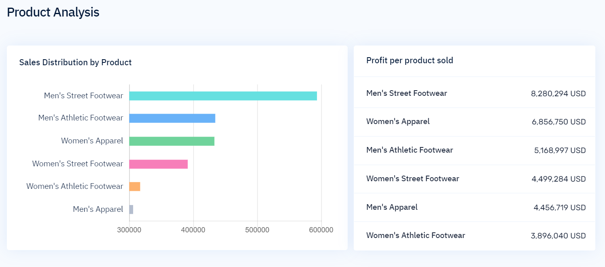
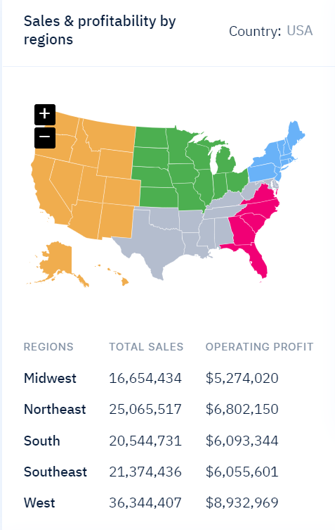

# Data Visualization Project with Django

## Table of Contents
- [Introduction](#introduction)
- [Installation](#installation)
- [Project Description](#project-description)
- [Requirements](#requirements)
- [Visualizations](#visualizations)
- [Design Elements](#design-elements)
- [Creating Visualizations](#creating-visualizations)
- [Analyzing and Reporting](#analyzing-and-reporting)
- [Screenshots](#screenshots)
- [Contributing](#contributing)
- [License](#license)
- [Acknowledgments](#acknowledgments)

## Introduction
Welcome to the Data Visualization project built with Django. This project aims to provide insights into the `data_sales.xlsx` dataset using various visualizations implemented in a Django dashboard.

## Installation
To set up the project, follow these steps:

1. Clone the repository.
2. Navigate to the project directory:

    ```bash
    cd adidas-sales-visualization
    ```
3. Create virtual environment:

    ```bash
    python -m venv venv
    ```
4. Activate the environment:
    Windows:
    ```bash
    .\venv\Scripts\activate
    ```
    macOS/linux
    ```bash
    source venv/bin/activate
    ```
5. Install the required dependencies using the following command:
    ```bash
    pip install -r requirements.txt
    ```
6. Run the Django development server:
    ```bash
    python manage.py runserver
    ```

## Project Description

### 1. Understand Your Data
   - **First Step:** Open the `data_sales.xlsx` dataset to gain insights into its structure and variables.
   - **Preparing Your Data:** Describe any data preprocessing steps undertaken for better analysis.

### 2. Choosing Your Visualizations
   - **Retailer Analysis:** Utilized bar charts to compare total sales and operating profit by retailer.
   - **Trends:** Implemented line graphs to visualize trends over time for variables like `Total Sales` and `Units Sold`.
   - **Geographical Insights:** Employed maps and choropleth maps to visualize sales by region or state.
   - **Product Analysis:** Utilized pie charts and bar charts to display the distribution of sales among different products.
   - **Price Analysis:** Created scatter plots to understand the relationship between `Price per Unit` and `Units Sold` or `Total Sales`.
   - **Sales Method Analysis:** Visualized the distribution of sales by different sales methods using pie charts or bar charts.
   - **Additional Insights:** Utilized various appropriate charts for additional variables.

### 3. Implementing Design Elements
   - **Consistency:** Maintained a consistent color scheme and style across all visualizations.
   - **Readability:** Ensured charts are easily readable with clear labels, legends, and titles.
   - **Highlight Key Insights:** Used annotations, highlighting, or visual cues to emphasize important findings.

### 4. Analyzing and Reporting
   - **Analysis:** Provided brief analyses for each visualization, identifying trends, outliers, or interesting patterns.
   - **Insights:** Summarized key insights and considered implications on Adidas's sales strategy and operations.


## Requirements
- Django==5.0.2
- numpy==1.26.4
- pandas==2.2.1
- python-dotenv==1.0.1
- sqlparse==0.4.4

## Screenshots





## Contributing
If you'd like to contribute to this project, please follow our [Contributing Guidelines](CONTRIBUTING.md).

## License
This project is licensed under the [MIT License](LICENSE.md) - see the [LICENSE.md](LICENSE.md) file for details.

## Acknowledgments
Give credit to any resources, libraries, or individuals you'd like to acknowledge for their contributions or inspiration.
